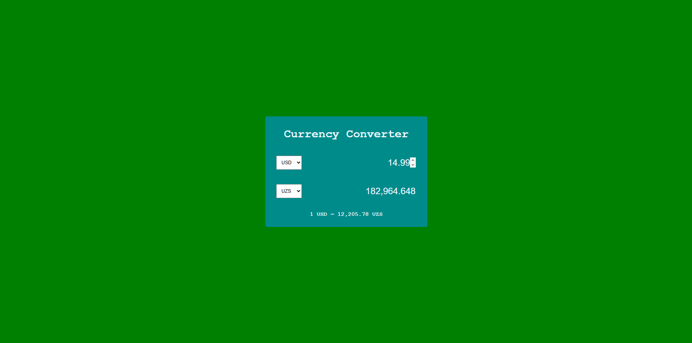

# 💱 Currency Converter

A simple Currency Converter web application built using **HTML, CSS, and JavaScript** that converts currencies in real time using an exchange rate API.

---

## 🚀 Live Demo

https://akbarboy777.github.io/currency-converter/

---

## 🛠️ Technologies Used

- HTML5
- CSS3
- JavaScript (Vanilla JS)
- ExchangeRate API (REST API)

---

## ✨ Features

- Real-time currency conversion
- Supports multiple currencies:
  - USD
  - UZS
  - EUR
  - AUD
  - CAD
  - INR
  - JPY
- Automatically updates conversion when:
  - Currency changes
  - Amount changes
- Clean and minimal user interface
- Live exchange rate display

---

## 📂 Project Structure
├── index.html
├── style.css
├── index.js


---

## ⚙️ How It Works

1. User selects base currency and target currency.
2. JavaScript fetches live exchange rates from the API.
3. The conversion rate is calculated instantly.
4. The result updates automatically when inputs change.

The project uses:

```js
fetch() 
to request real-time currency data from an external API.

---

## 🎯 Future Improvements

- Add currency swap button
- Add more currencies
- Add loading indicator
- Improve mobile responsiveness
- Handle API errors gracefully

---

## 📸 Preview



---

## 👨‍💻 Author

Umarov Akbar
https://github.com/AkbarBoy777